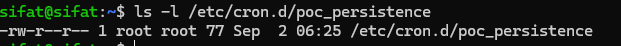
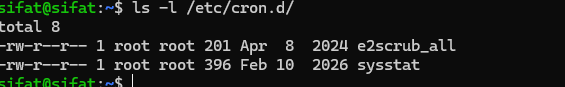
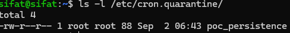

# Cron Persistence Detection Lab with Wazuh FIM

A safe detection-engineering lab demonstrating Linux cron persistence and its detection with Wazuh File Integrity Monitoring (FIM).

> **Safety:** The scheduled command is harmless. It only appends a test message to `/tmp/cron_test.log`. Run this lab only in an authorized test environment.

## Lab Overview

| Component | Details |
|---|---|
| Wazuh Manager | `10.0.2.6` |
| Ubuntu Target | `10.0.2.7` |
| Wazuh Agent | `ubuntu-target-10.0.2.7` (ID `003`) |
| Persistence Artifact | `/etc/cron.d/poc_persistence` |
| Test Output | `/tmp/cron_test.log` |
| MITRE ATT&CK | [T1053.003 – Scheduled Task/Job: Cron](https://attack.mitre.org/techniques/T1053/003/) |

## Detection Workflow

```text
Cron Job Created/Modified → Wazuh FIM → Rule 550 → Analyst Validation
→ Quarantine/Removal → Rule 553 → Containment Confirmed
```

## 1. Configure Wazuh FIM

Add the contents of [config/wazuh-fim-config.xml](config/wazuh-fim-config.xml) inside the `<syscheck>` section of `/var/ossec/etc/ossec.conf`, then restart the agent:

```bash
sudo systemctl restart wazuh-agent
sudo systemctl status wazuh-agent
```

## 2. Simulate Cron Persistence

```bash
echo '*/2 * * * * root echo "Cron persistence test executed" >> /tmp/cron_test.log' | sudo tee /etc/cron.d/poc_persistence
sudo chmod 644 /etc/cron.d/poc_persistence
ls -l /etc/cron.d/poc_persistence
cat /etc/cron.d/poc_persistence
```

### Evidence — Cron artifact created



Wait at least two minutes and check `/tmp/cron_test.log`.

## 3. Generate and Detect a Modification

```bash
sudo sh -c 'echo "# FIM test" >> /etc/cron.d/poc_persistence'
```

Search Wazuh for `poc_persistence`, `Syscheck`, or `rule.id:550`.

### Evidence — Rule 550


The alert recorded decoder `syscheck_integrity_changed`, file path, ownership, timestamps, and MD5/SHA1/SHA256 changes.

## 4. Containment and Removal

```bash
sudo mkdir -p /etc/cron.quarantine
sudo mv /etc/cron.d/poc_persistence /etc/cron.quarantine/
ls -l /etc/cron.d/
ls -l /etc/cron.quarantine/
```

### Evidence — Artifact removed and quarantined





### Evidence — Rule 553


## Detection Summary

| Event | Wazuh Rule | Evidence |
|---|---:|---|
| Cron file modified | 550 | File path, hashes, timestamps, ownership |
| Cron file removed | 553 | Deleted path and agent details |
| Containment | N/A | File absent from active directory and present in quarantine |

## MITRE ATT&CK Mapping

| Tactic | Technique | ID |
|---|---|---|
| Persistence | Scheduled Task/Job: Cron | T1053.003 |

## Repository Contents

- [Wazuh FIM configuration](config/wazuh-fim-config.xml)
- [Safe simulation script](scripts/cron-persistence-simulation.sh)
- [Detection details](detection/wazuh-alert-details.md)
- [Screenshot index](screenshots/README.md)

## Outcome

The lab successfully demonstrated cron-based persistence in a controlled Ubuntu environment. Wazuh FIM detected the artifact modification, preserved forensic metadata, and generated a deletion alert after containment.
