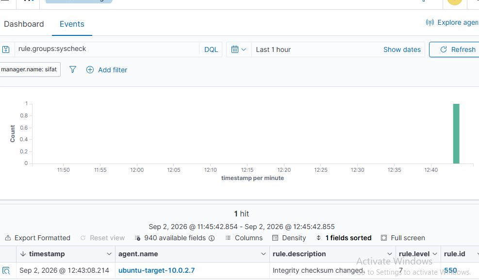
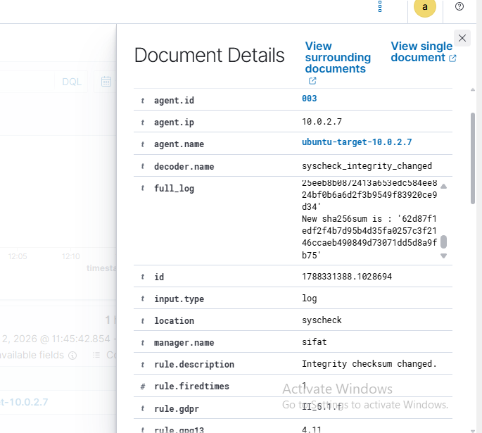
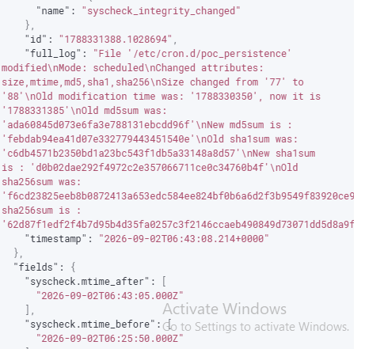
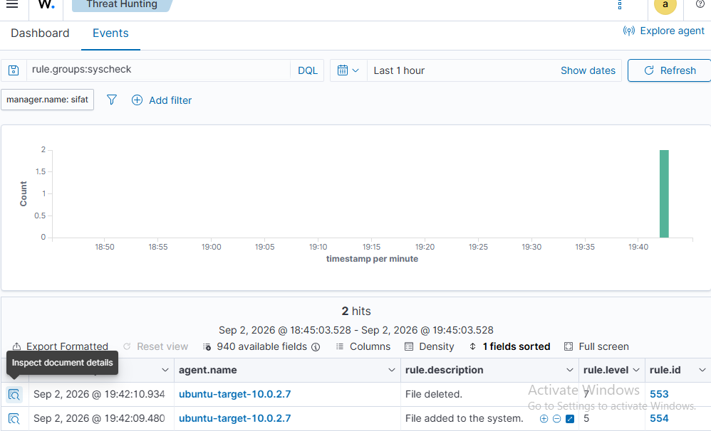
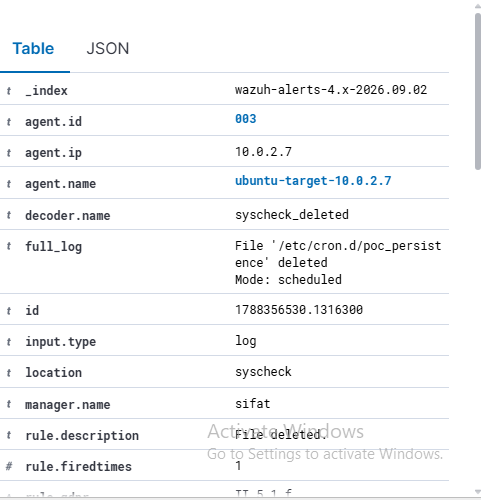

# Wazuh Detection Evidence

## Environment

- Wazuh Manager: `10.0.2.6`
- Ubuntu agent: `ubuntu-target-10.0.2.7` (ID `003`), IP `10.0.2.7`
- Monitored artifact: `/etc/cron.d/poc_persistence`

## Rule 550 — Integrity checksum changed

Wazuh FIM detected modification of the cron artifact. The alert used decoder `syscheck_integrity_changed` and recorded the file path, ownership, timestamps, and MD5/SHA1/SHA256 values.

## Rule 553 — File deleted

After the file was moved to `/etc/cron.quarantine/`, Wazuh detected deletion from the active cron directory.

